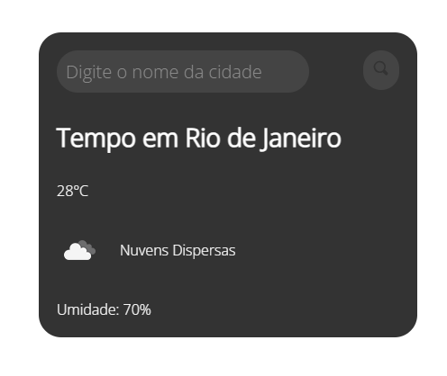

# Previsão do Tempo

Este projeto tem como objetivo mostrar a previsão do tempo em tempo real utilizando a API OpenWeatherMap e mudando a imagem de fundo da tela a cada vez que a página é carregada através da API Source.unsplash.

## Pré-requisitos
- Ter uma chave de API do OpenWeatherMap (https://openweathermap.org/api)
- Conexão com a internet

## Como utilizar
1. Clone o repositório em sua máquina local:
```
git clone https://github.com/reibrito/previsao-do-tempo.git
```

2. Abra o arquivo `index.html` em seu navegador.

3. Insira sua chave de API do OpenWeatherMap no arquivo `script.js`:
```javascript
const api_key = 'sua-chave-de-api';
```
4. Agora você poderá visualizar a previsão do tempo para a sua localização atual.

## Demonstração

https://ReiBrito.github.io/previsao-do-tempo/

## Tela



## Tecnologias Utilizadas
- HTML
- CSS
- JavaScript
- API OpenWeatherMap
- API Source.unsplash

## Licença
Este projeto está licenciado sob a licença MIT - veja o arquivo [LICENSE.md](LICENSE.md) para mais detalhes.
